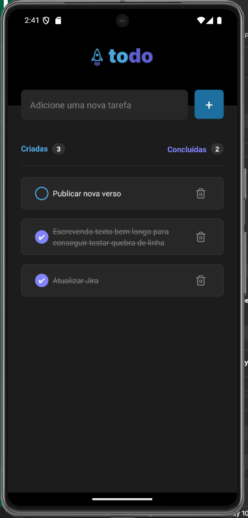

# Todo List App

O **Todo List App** é um aplicativo mobile desenvolvido em **React Native** utilizando **Expo**. Ele permite gerenciar tarefas de forma simples e eficiente, com funcionalidades para adicionar, remover e listar tarefas.

## Funcionalidades

- Adicionar tarefas à lista
- Marcar tarefas como concluídas
- Remover tarefas da lista
- Listar todas as tarefas pendentes e concluídas

## Tecnologias Utilizadas

- **React Native**: Framework para desenvolvimento mobile
- **Expo**: Plataforma para desenvolvimento e execução de aplicativos React Native
- **TypeScript**: Linguagem de programação utilizada

## Como Executar o Projeto

1. Clone o repositório:
    ```sh
    git clone https://github.com/seu-usuario/todo-list-app.git
    ```
2. Navegue até o diretório do projeto:
    ```sh
    cd todo-list-app
    ```
3. Instale as dependências:
    ```sh
    npm install
    ```
4. Inicie o projeto:
    ```sh
    expo start
    ```
5. Escaneie o QR Code com o aplicativo Expo Go no seu dispositivo móvel ou execute em um emulador.

## Estrutura do Projeto

- **src/components**: Componentes reutilizáveis do aplicativo
- **src/screens**: Telas principais do aplicativo
- **src/assets**: Recursos estáticos como imagens e ícones

## Contribuição

1. Faça um fork do projeto:
    ```sh
    git fork https://github.com/seu-usuario/todo-list-app.git
    ```
2. Crie uma branch para sua feature:
    ```sh
    git checkout -b minha-feature
    ```
3. Commit suas mudanças:
    ```sh
    git commit -m 'Adiciona nova feature'
    ```
4. Faça um push para a branch:
    ```sh
    git push origin minha-feature
    ```
5. Abra um Pull Request descrevendo suas alterações.

---
Sinta-se à vontade para contribuir e melhorar este projeto! 🚀